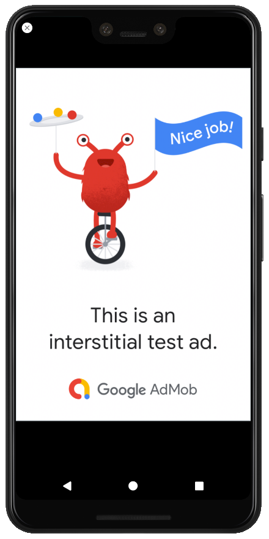
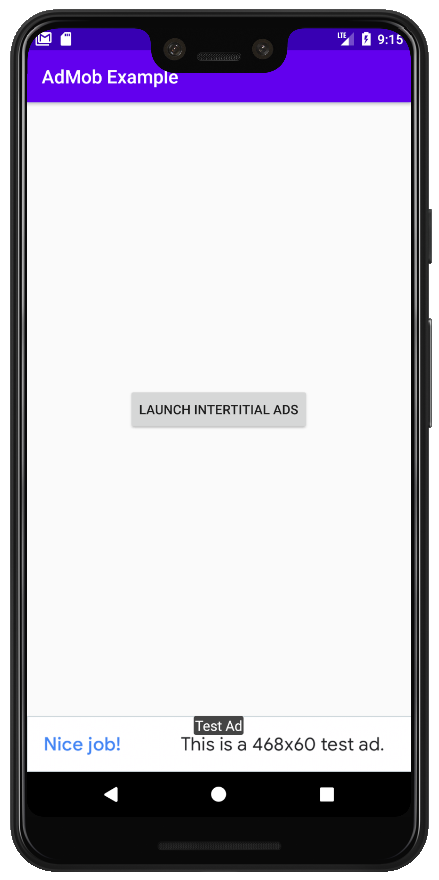

# AdMob-Example
AdMob example to monetise our apps, Full Banner and Interstitial Ads.

"Integrating the Google Mobile Ads SDK into an app is the first step toward displaying ads and earning revenue". (https://developers.google.com/admob/android/quick-start)

## Prerequisites:

* Use Android Studio 3.2 or later.
* MinSdkVersion 16 or later.
* CompileSdkVersion 28 or later.
* Create a [Google AdMob account](https://support.google.com/admob/answer/7356219?visit_id=637243256305925708-3763117322&rd=1) and [register an app](https://support.google.com/admob/answer/2773509).

Next, open the app-level build.gradle file for your app, and look for a "dependencies" section (Check for an updated version).

```
implementation 'com.google.android.gms:play-services-ads:19.1.0'
```

## Update AndroidManifest.xml (between "application" tags):

```
<!-- Sample AdMob App ID: ca-app-pub-3940256099942544~3347511713 -->
<meta-data
     android:name="com.google.android.gms.ads.APPLICATION_ID"
     android:value="ca-app-pub-xxxxxxxxxxxxxxxx~yyyyyyyyyy"/>
```

**Important:** Each AdView component MUST have an unique UnitId. For debugging, you MUST use only Sample AdMob App Id and Sample AdMob Unit Id. For production, you can use the reals Ids.
AdView Example:

```
# main_activity.xml
...
  <com.google.android.gms.ads.AdView
      xmlns:ads="http://schemas.android.com/apk/res-auto"
      android:id="@+id/adView"
      android:layout_width="wrap_content"
      android:layout_height="wrap_content"
      ads:adSize="BANNER"
      ads:adUnitId="ca-app-pub-3940256099942544/6300978111">
  </com.google.android.gms.ads.AdView>
...
```

**Important:** adSize can have the following values: BANNER, LARGER_BANNER, FULL_BANNER, SMART_BANNER. Checking this [site](https://developers.google.com/admob/android/banner#banner_sizes) for details.

**Important:** Sample AdMob Ids:

```
...
Unit Id:
      ads:adUnitId="ca-app-pub-3940256099942544/6300978111">
...
App Id: 
      ca-app-pub-3940256099942544~3347511713
```

<p align="center">
  
</p>
